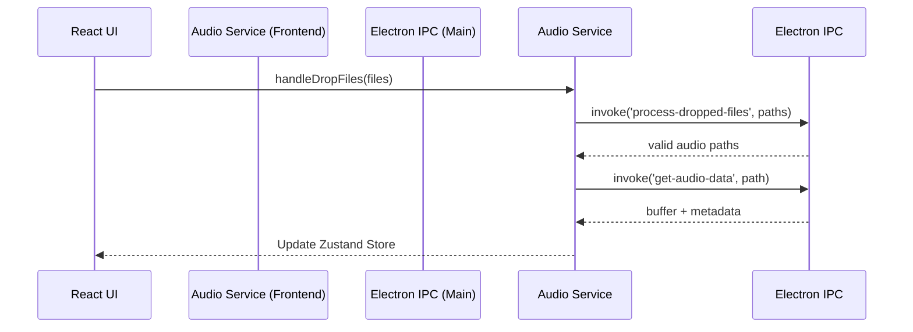

# Design: Refactor Estructura (Electron + React)

## Architecture Decisions

### 1. Electron Main Process Modularization
**Rationale:** `main.js` agrupa demasiadas responsabilidades (creación de ventana, IPC de ventana, IPC de audio, menú). Dividirlo permite un mantenimiento más sencillo y previene un archivo gigante a futuro.
- `core/windowManager.js`: Responsable exclusivo de la creación y configuración de `BrowserWindow` y del `Menu`.
- `ipc/audioHandlers.js`: Contiene solo lógica que tiene que ver con archivos de audio (metadata, parsing).
- `ipc/windowHandlers.js`: Maneja eventos de UI para la barra superior custom (minimizar, cerrar, maximizar).

### 2. Frontend Mixed Architecture (Features + Global)
**Rationale:** Evitar el "spaghetti" donde componentes de UI puros (botones, modales) se mezclan con componentes que saben sobre el negocio (reproductor de música).
- `src/features/audio/`: Todo lo específico a la música (sus componentes propios, sus hooks, su slice de Zustand y servicios que hablan por IPC de Electron) irá aquí.
- `src/components/`: Solo componentes "tontos" o de UI general.
- `src/hooks/` y `src/services/`: Lógica compartida por múltiples features.

## Sequence Diagram: IPC Audio Flow

