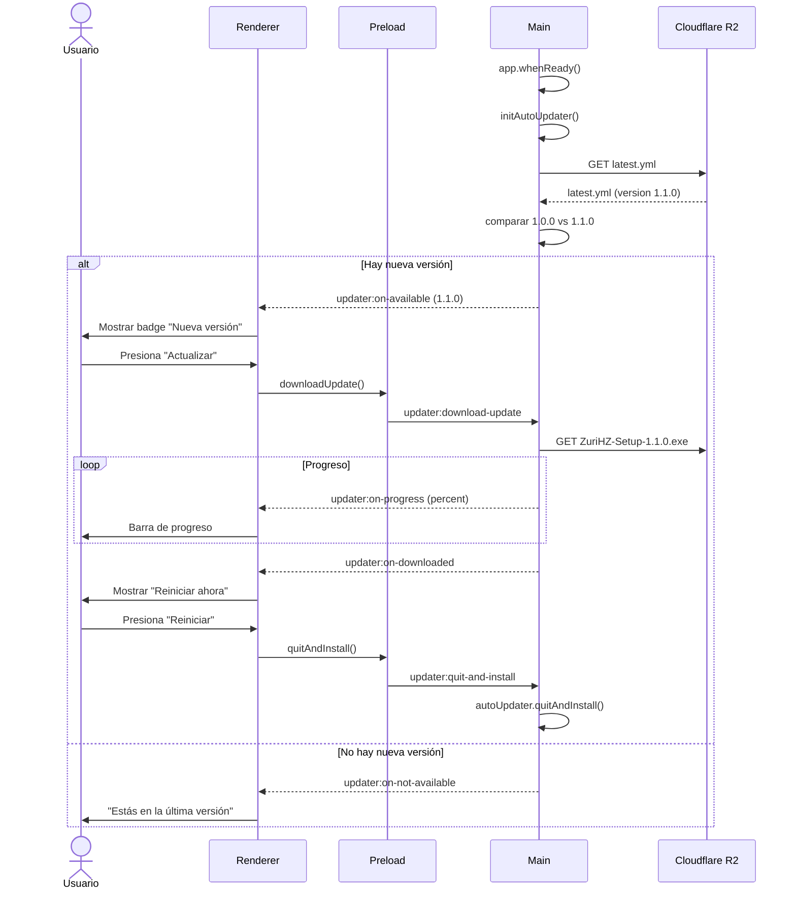

# Design: Auto-Update con Cloudflare R2

## Technical Approach

Agregar un sistema de actualización automática a ZuriHZ usando `electron-updater` con Cloudflare R2 como backend de distribución. La app chequea periódicamente si hay una nueva versión, la descarga en background y pide al usuario reiniciar para aplicarla.

Arquitectura de tres capas, sin cambiar el modelo de seguridad actual:

1. **Main** — Configura `electron-updater` con provider `s3` (R2). Escucha eventos. Expone IPC handlers.
2. **Preload** — Bridge mínimo `electronAPI.updater.*` vía `contextBridge`.
3. **Renderer** — Componentes React de notificación/progreso. Consume solo el bridge.

Scope lock: **solo** auto-update vía R2. No CI/CD. No code signing. No multi-platform por ahora.

## Architecture Decisions

### AD-1: Provider `s3` con Cloudflare R2

| | |
|--|--|
| **Choice** | Usar el provider `s3` de `electron-updater` apuntando a Cloudflare R2 (compatible con API S3). |
| **Alternatives** | (a) provider `generic` con un servidor HTTP propio; (b) provider `github` con GitHub Releases; (c) provider `ownServer`. |
| **Rationale** | R2 es gratis, sin egress fees, y compatible con S3. El provider `s3` está maduro en electron-updater. Ya tenés el bucket configurado. |

### AD-2: Auto-update solo para contenido (no para el binario de Electron)

| | |
|--|--|
| **Choice** | La actualización reemplaza los archivos de la app (renderer + main process JS) pero NO actualiza el binario de Electron en sí. |
| **Alternatives** | (a) Full update incluyendo el ejecutable de Electron; (b) Solo actualizar el renderer. |
| **Rationale** | NSIS installer en Windows soporta actualización de contenido. Actualizar el binario de Electron requiere un installer completo y permisos admin. Para v1, content update es suficiente y más simple. |

### AD-3: Check automático + manual

| | |
|--|--|
| **Choice** | Chequeo automático al abrir la app (con delay de 3s para no bloquear el inicio) + botón manual "Buscar actualizaciones" en config. |
| **Alternatives** | (a) Solo check automático; (b) Solo manual; (c) Chequeo periódico en background. |
| **Rationale** | Combinación de UX: el usuario está informado sin hacer nada, pero también tiene control. Delay de 3s evita flooding la red si el usuario cierra rápido. |

### AD-4: Notificación visual discreta

| | |
|--|--|
| **Choice** | Badge sutil en el header/sidebar + toast/modal cuando la descarga está lista. Sin interrupciones agresivas. |
| **Alternatives** | (a) ModalFullScreen que bloquea la app; (b) Solo notificación del sistema operativo; (c) Popup nativo de Electron. |
| **Rationale** | El usuario debe seguir usando la app mientras descarga. Notificación discreta respeta la experiencia. El modal solo aparece cuando la descarga termina y pide reiniciar. |

### AD-5: Credenciales nunca en el renderer

| | |
|--|--|
| **Choice** | Las credenciales de R2 (Access Key, Secret Key) viven SOLO en el proceso main, en el config de electron-builder (inyectadas en build time). El renderer nunca las ve. |
| **Alternatives** | (a) Pasar credenciales al renderer via IPC; (b) Variables de entorno en runtime. |
| **Rationale** | Seguridad: `contextIsolation: true` significa que el renderer no puede acceder a variables de entorno del main. Las credenciales se bake-en en el binario durante el build, que es el patrón estándar de electron-updater. |

### AD-6: Script de upload separado

| | |
|--|--|
| **Choice** | Script Node.js `scripts/upload-to-r2.js` que usa el SDK de S3 para subir los archivos generados por electron-builder a R2. |
| **Alternatives** | (a) Wrangler CLI directo; (b) Subida manual via dashboard; (c) GitHub Actions. |
| **Rationale** | Script reproducible que el desarrollador ejecuta después de `pnpm dist`. Más simple que configurar CI/CD para v1. Wrangler es para archivos estáticos, no para upload S3-compatible. |

## Data Flow

### Auto-check al iniciar la app

```
App Electron se abre
        ↓
main.js llama a initAutoUpdater()
        ↓
electron-updater lee la config publish (R2 endpoint)
        ↓
Descarga latest.yml desde R2
        ↓
Compara version local (app.getVersion()) vs version en latest.yml
        ↓
┌─────────────────────────────────────┐
│ Si son iguales: no-op silencioso    │
│ Si hay diferencia:                  │
│   → Emite evento 'update-available' │
│   → Renderer muestra badge/toast    │
└─────────────────────────────────────┘
```

### Descarga de actualización

```
Usuario presiona "Actualizar" o "Buscar actualizaciones"
        ↓
Renderer → IPC: updater:check-for-update
        ↓
Main: autoUpdater.checkForUpdates()
        ↓
electron-updater descarga el instalador en background
        ↓
Progreso:.emitido via IPC → renderer muestra barra de progreso
        ↓
Descarga completa: 'update-downloaded' event
        ↓
Renderer muestra "Reiniciar ahora"
        ↓
Usuario presiona "Reiniciar"
        ↓
Main: autoUpdater.quitAndInstall()
        ↓
App se cierra → installer aplica cambios → app se reabre
```

### Upload de nueva versión (desarrollador)

```
Desarrollador ejecuta: pnpm dist
        ↓
electron-builder genera instaladores en /release/
        ↓
Desarrollador ejecuta: node scripts/upload-to-r2.js
        ↓
Script lee archivos de /release/
        ↓
Sube a R2: latest.yml + instaladores
        ↓
R2 sirve los archivos públicamente
        ↓
Próxima vez que la app abra, detecta la nueva versión
```

## File Changes

| Path | Action | Notes |
|------|--------|-------|
| `package.json` | Modified | Agregar dep `electron-updater`; config `publish` |
| `electron/updater/config.js` | New | Config de autoUpdater con provider s3 |
| `electron/updater/handlers.js` | New | Event listeners de autoUpdater |
| `electron/updater/index.js` | New | Export de initAutoUpdater |
| `electron/ipc/updaterHandlers.js` | New | IPC handlers para updater |
| `electron/main.js` | Modified | Importar y llamar initAutoUpdater |
| `electron/preload.js` | Modified | Exponer `electronAPI.updater.*` |
| `src/components/updater/UpdateNotification.tsx` | New | Badge/toast de notificación |
| `src/components/updater/UpdateProgress.tsx` | New | Barra de progreso de descarga |
| `src/components/updater/UpdateReady.tsx` | New | Modal "Reiniciar ahora" |
| `src/components/updater/index.ts` | New | Barrel export |
| `src/hooks/useUpdater.ts` | New | Hook para estado del updater |
| `src/pages/config.tsx` | Modified | Sección de actualizaciones |
| `src/types/electron.d.ts` | Modified | Tipos del bridge updater |
| `scripts/upload-to-r2.js` | New | Script de upload a R2 |
| `docs/auto-update-cloudflare-r2.md` | New | Documentación (ya creada) |
| `.env.example` | New | Variables de entorno de ejemplo |

## Interfaces / Contracts

### TypeScript bridge (renderer)

```ts
// src/types/electron.d.ts (excerpt updater)

export type UpdaterState = 'idle' | 'checking' | 'available' | 'not-available' | 'downloading' | 'downloaded' | 'error'

export type UpdaterInfo = {
  version: string
  releaseDate?: string
  releaseNotes?: string
}

export type UpdaterProgress = {
  percent: number
  bytesPerSecond: number
  total: number
  transferred: number
}

export type UpdaterError = {
  code: string
  message: string
}

export interface UpdaterApi {
  checkForUpdates(): Promise<{ state: UpdaterState; info?: UpdaterInfo }>
  downloadUpdate(): Promise<void>
  quitAndInstall(): Promise<void>
  onUpdateAvailable(callback: (info: UpdaterInfo) => void): void
  onUpdateNotAvailable(callback: () => void): void
  onDownloadProgress(callback: (progress: UpdaterProgress) => void): void
  onUpdateDownloaded(callback: (info: UpdaterInfo) => void): void
  onUpdateError(callback: (error: UpdaterError) => void): void
}

interface ElectronAPI {
  updater: UpdaterApi
  // ...existing
}
```

### IPC channels (main ↔ preload)

| Channel | Direction | Payload in | Payload out |
|---------|-----------|------------|-------------|
| `updater:check-for-update` | invoke | — | `{ state, info? }` |
| `updater:download-update` | invoke | — | void (emite eventos) |
| `updater:quit-and-install` | invoke | — | void |
| `updater:on-available` | on | `UpdaterInfo` | — |
| `updater:on-not-available` | on | — | — |
| `updater:on-progress` | on | `UpdaterProgress` | — |
| `updater:on-downloaded` | on | `UpdaterInfo` | — |
| `updater:on-error` | on | `UpdaterError` | — |

### Cloudflare R2 bucket structure

```
zurihz-updates/
├── latest.yml                    ← Manifest de la última versión
├── ZuriHZ-Setup-1.1.0.exe       ← Instalador Windows
├── ZuriHZ-Setup-1.0.0.exe       ← Versión anterior (se mantiene)
└── ...
```

## Sequence Diagrams

### Happy path: auto-update al abrir la app



## Testing Strategy

1. **Manual smoke (Phase 4)**
   - Configurar R2 con un `latest.yml` de prueba
   - Verificar que la app detecta la nueva versión
   - Verificar que la descarga funciona
   - Verificar que "Reiniciar ahora" cierra y reabre la app
   - Verificar que el error de red se muestra sin crashear

2. **Security checklist**
   - Credenciales de R2 no visibles en DevTools
   - Credenciales no en respuestas IPC al renderer
   - Bucket R2 con permisos mínimos (read/write solo en bucket específico)

3. **Build verification**
   - `npm run build` pasa
   - `pnpm dist` genera instaladores correctamente
   - `latest.yml` se genera con la versión correcta

## Migration / Rollout

1. Instalar `electron-updater`
2. Crear módulo `electron/updater/`
3. Configurar `publish` en package.json
4. Crear componentes React
5. Testear localmente con R2
6. Primer release: subir a R2 con script
7. Verificar que la app detecta la nueva versión

Sin migraciones de DB. Sin cambios en la experiencia del usuario existente (solo se agrega la funcionalidad de update).

## Open Questions

1. **Frecuencia de chequeo** — ¿Solo al abrir la app o también periódicamente? (Preferencia: solo al abrir + manual)
2. **NSIS vs Full** — ¿Usar NSIS installer para la actualización o un setup completo? (Preferencia: NSIS, que es lo que ya está configurado)
3. **Notificación del SO** — ¿Usar `autoUpdater.autoDownload = false` para control total? (Preferencia: sí, control manual)
4. **Fallback a download manual** — ¿Si falla auto-update, mostrar link de descarga web? (Preferencia: sí, como fallback)
