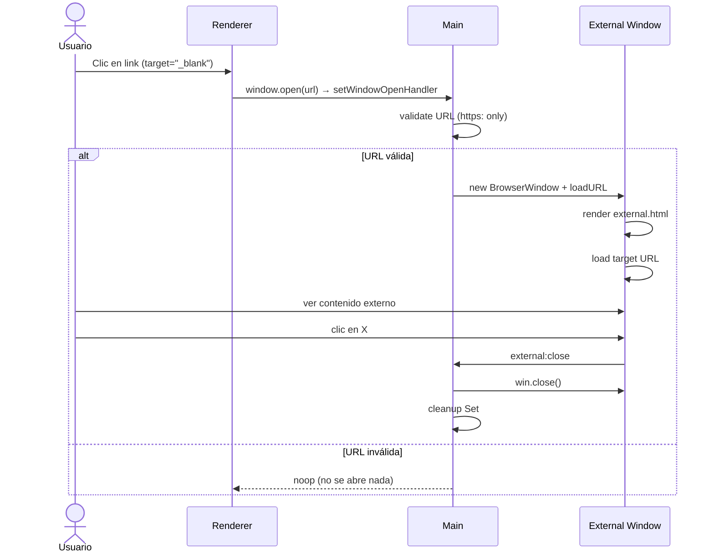
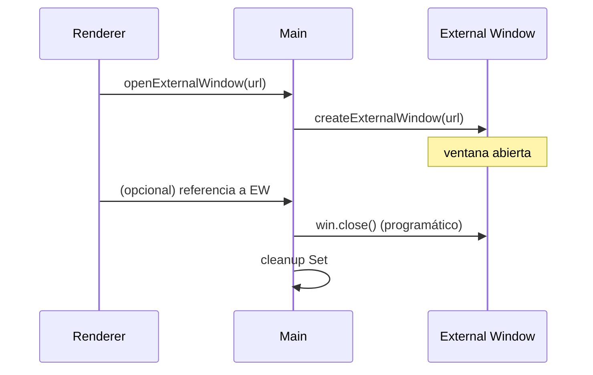

# Design: Ventanas Externas con Diseño Custom

## Technical Approach

Implementar un sistema de ventanas externas que intercepte `window.open()` y lo redirija a BrowserWindow custom con diseño minimalista, reemplazando el chrome default de Electron.

Arquitectura de separación: las ventanas externas son BrowserWindow independientes con su propio HTML/CSS/preload, sin conexión al renderer principal de React.

1. **Main** — `externalWindowManager.js` como factory; `setWindowOpenHandler()` como interceptor; validación de URLs.
2. **Preload externo** — Bridge mínimo: solo `closeWindow()`.
3. **HTML externo** — Página autocontenida con title bar + `<iframe>` o `loadURL` directo.

Scope lock: **solo** ventanas externas con diseño custom. No multi-window manager. No webview del renderer. No cambios al TitleBar principal.

## Architecture Decisions

### AD-1: BrowserWindow propio en vez de webview en el renderer

| | |
|--|--|
| **Choice** | Cada link `target="_blank"` crea una nueva `BrowserWindow` independiente con `win.loadURL(url)`, no un `<webview>` embebido en la ventana principal. |
| **Alternatives** | (a) `<webview>` en un tab o panel de la app principal; (b) `shell.openExternal()` al navegador del sistema; (c) reusar el renderer React con una ruta nueva. |
| **Rationale** | BrowserWindow independiente es el patrón estándar de Electron para contenido externo. Permite control total del chrome (title bar custom). No contamina el renderer principal con contenido de terceros. `shell.openExternal` pierde el control del diseño. |

### AD-2: HTML autocontenido en vez de reusar el renderer

| | |
|--|--|
| **Choice** | Las ventanas externas cargan un HTML estático (`external.html`) que no depende de Vite ni del build de React. |
| **Alternatives** | (a) Ruta `/external/:url` en el renderer React; (b) include dinámico del index.html. |
| **Rationale** | El renderer tiene React, Zustand, routing — todo innecesario para mostrar una URL externa. Un HTML liviano reduce tiempo de carga, evita colisiones de routing, y mantiene aislamiento total. |

### AD-3: Title bar simplificado sin minimize/maximize

| | |
|--|--|
| **Choice** | La ventana externa solo tiene botón de cerrar (X). No tiene minimize ni maximize. |
| **Alternatives** | (a) Title bar igual al de la ventana principal (con los 4 botones); (b) sin title bar y usar `mouse` para arrastrar; (c) usar el frame nativo del OS. |
| **Rationale** | Las ventanas externas son contenido de referencia, no ventanas de trabajo principal. Minimizar/maximizar crearía confusión con la ventana principal. Un solo botón de cerrar es más limpio y reduce el surface de interacción. |

### AD-4: Validación de URLs en setWindowOpenHandler

| | |
|--|--|
| **Choice** | Solo permitir URLs con protocolo `https:`. Rechazar `file://`, `javascript:`, `data:`, `http:` (inseguro), y cualquier otro protocolo. |
| **Alternatives** | (a) Permitir todos los protocolos; (b) allowlist de dominios específica. |
| **Rationale** | `https:` es el mínimo razonable de seguridad. `file://` expondría el filesystem. `javascript:` permite XSS. Una allowlist de dominios sería demasiado restrictiva para una app que navega web abierta. |

### AD-5: Límite de ventanas concurrentes

| | |
|--|--|
| **Choice** | Mantener un `Set<BrowserWindow>` de ventanas externas abiertas. Limpiar referencias en `closed` event. Sin límite numérico hardcodeado en v1 (Electron maneja memoria). |
| **Alternatives** | (a) Límite de 3-5 ventanas con UI de "cierra una primero"; (b) reutilizar una sola ventana externa cambiando la URL. |
| **Rationale** | Un Set limpio previene memory leaks. En v1 no se anticipa abuso de ventanas. Se puede agregar límite en v2 si es necesario. |

### AD-6: Preload dedicado mínimo

| | |
|--|--|
| **Choice** | Preload separado (`externalPreload.js`) que solo expone `window.electronAPI.closeWindow()`. |
| **Alternatives** | (a) Reusar el preload principal; (b) no usar preload (Content Security Policy strict). |
| **Rationale** | Reusar el preload principal expondría APIs innecesarias (audio, theme, devtools) a contenido de terceros. Un preload dedicado mantiene el principio de mínimo privilegio. |

## Data Flow

### Apertura de ventana externa

```
Renderer (any page)          Main (windowManager)         Main (externalWindowManager)
       |                            |                              |
       |-- window.open(url) ------->|                              |
       |-- (target="_blank")        |                              |
       |                            |-- setWindowOpenHandler       |
       |                            |-- validate: https: only      |
       |                            |-- createExternalWindow(url)->|
       |                            |                              |-- new BrowserWindow({frame:false, ...})
       |                            |                              |-- win.loadURL(url)
       |                            |                              |-- externalPreload.js
       |                            |                              |-- win.on('closed') → cleanup
       |                            |<-- win reference ------------|
       |<- new window opens --------|                              |
```

### Cierre de ventana externa

```
External Window (renderer)    External Preload              Main (externalWindowManager)
       |                            |                              |
       |-- click X button --------->|                              |
       |-- electronAPI.closeWindow()|                              |
       |                            |-- ipcRenderer.send           |
       |                            |-------- external:close ----->|
       |                            |                              |-- win.close()
       |                            |                              |-- Set.delete(win)
       |<- window closes -----------|                              |
```

## File Changes

| Path | Action | Notes |
|------|--------|-------|
| `electron/core/externalWindowManager.js` | New | Factory: createExternalWindow(url), Set de ventanas activas, cleanup |
| `electron/external/external.html` | New | HTML template: title bar + iframe/loadURL |
| `electron/external/external.css` | New | Estilos: mismos design tokens, title bar simplificado |
| `electron/external/externalPreload.js` | New | Preload mínimo: closeWindow() |
| `electron/core/windowManager.js` | Modified | Agregar `setWindowOpenHandler()` con validación |
| `electron/ipc/windowHandlers.js` | Modified | Registrar canal `external:close` |
| `electron/preload.js` | Modified (opcional) | Agregar `openExternalWindow(url)` para que el renderer pueda abrir ventanas externas de forma controlada |

## Interfaces / Contracts

### IPC channels

| Channel | Direction | Payload in | Payload out |
|---------|-----------|------------|-------------|
| `external:close` | send (renderer→main) | — | — |

### Preload externo (window.electronAPI en ventanas externas)

```ts
interface ExternalElectronAPI {
  closeWindow: () => void
}
```

### Preload principal (extensión opcional)

```ts
interface ElectronAPI {
  // ...existing
  openExternalWindow: (url: string) => Promise<void>
}
```

### externalWindowManager API (main process)

```js
/**
 * Crea una BrowserWindow externa con diseño custom
 * @param {string} url - URL a cargar (debe ser https:)
 * @param {BrowserWindow} parent - Ventana padre (opcional, para center)
 * @returns {BrowserWindow} ventana creada
 */
function createExternalWindow(url, parent)
```

## Sequence diagrams

### Happy path: link target="_blank"



### Cierre programático desde el renderer



## Testing Strategy

1. **Unit (main process)**
   - `createExternalWindow`: crear ventana, verificar que `frame: false`, verificar cleanup al cerrar
   - Validación de URLs: acepta `https://github.com`, rechaza `file:///etc/passwd`, `javascript:alert(1)`, `http://insecure.com`
   - Set de ventanas: verificar que se agrega al crear y se elimina al cerrar

2. **Manual smoke**
   - Hacer clic en un link `target="_blank"` en la app → se abre ventana externa con diseño custom
   - Verificar que la ventana externa NO tiene title bar nativa del OS
   - Verificar que el botón X cierra la ventana
   - Verificar que URLs `https://` cargan correctamente
   - Verificar que URLs `file://` son rechazadas silenciosamente
   - Verificar que la ventana principal no se ve afectada
   - `npm run build` pasa

3. **Security checklist**
   - Grep: no `nodeIntegration: true` en ventanas externas
   - Grep: no `webviewTag: true` innecesario en ventanas externas
   - Verificar que `contextIsolation: true` y `sandbox: true` en BrowserWindow externo
   - Verificar que el preload externo NO expone APIs del preload principal

## Migration / Rollout

1. Crear módulo `externalWindowManager.js` + archivos en `electron/external/`
2. Agregar `setWindowOpenHandler()` en `windowManager.js`
3. Registrar canal `external:close` en `windowHandlers.js`
4. Smoke manual con links existentes en la app
5. Sin migraciones de DB. Sin cambios en el renderer.

## Open Questions

1. **¿Usar `<iframe>` o `win.loadURL()` directo?** — `loadURL` es más simple pero navega el BrowserWindow completo. `iframe` dentro de external.html da más control pero algunos sitios bloquean iframe (X-Frame-Options). Preferencia: `loadURL` directo como v1.
2. **¿Permitir que el renderer controle la ventana externa?** — ¿Solo interceptar `window.open()` o también expone una API `openExternalWindow(url)` para uso programático? Preferencia: ambas.
3. **¿Soporte a múltiples monitores?** — ¿Posicionar la ventana externa cerca del cursor o sobre la ventana padre? Preferencia: center sobre parent en v1.
4. **¿Permitir `http:` en desarrollo?** — Algunos dev servers locales usan http. Preferencia: permitir `http://localhost:*` en dev, solo `https:` en producción.
