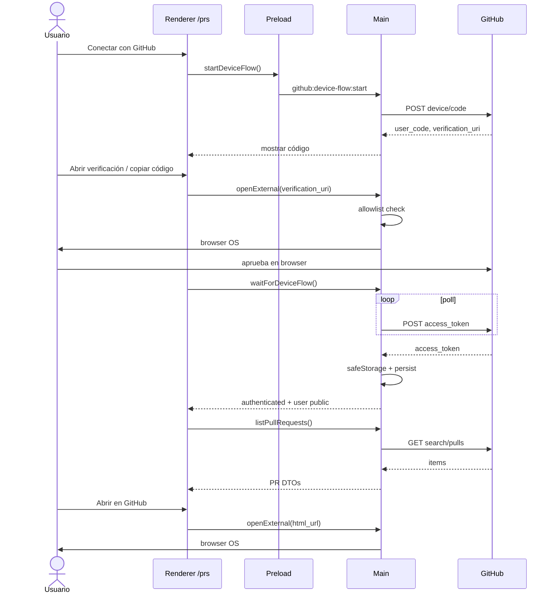

# Design: GitHub PRs in-app

## Technical Approach

Agregar una sección nativa `/prs` en el shell Electron existente para autenticar con GitHub (Device Flow), listar y ver detalle básico de PRs del usuario, y abrir el PR completo en el navegador del sistema cuando haga falta.

Arquitectura de tres capas, sin cambiar el modelo de seguridad actual (`contextIsolation: true`, `nodeIntegration: false`, `sandbox: true`):

1. **Main** — Device Flow, token cifrado con `safeStorage`, cliente REST a `api.github.com`, validación de `openExternal`, handlers IPC.
2. **Preload** — bridge mínimo tipado `electronAPI.github.*` vía `contextBridge`.
3. **Renderer** — página React + HashRouter; solo consume el bridge; nunca ve el token.

Scope lock: **solo** GitHub PRs in-app. No multi-window manager. No webview de github.com como path principal. Cero o mínimas deps (preferir `fetch` nativo de Electron/Node).

## Architecture Decisions

### AD-1: API solo en main

| | |
|--|--|
| **Choice** | Todas las llamadas a `api.github.com` y `github.com` (device/code) viven en el proceso main. El renderer solo invoca IPC. |
| **Alternatives** | (a) fetch desde renderer con token inyectado; (b) proxy HTTP local. |
| **Rationale** | Evita exponer el token al renderer/DevTools. Mantiene `sandbox` y reduce superficie de ataque. Un solo lugar para rate-limit, sanitizar errores y cache corto. |

### AD-2: Device Flow como auth primaria

| | |
|--|--|
| **Choice** | OAuth 2.0 Device Authorization Grant: main pide `user_code` + `verification_uri`, UI muestra código, main hace polling hasta token/deny/expiry/cancel. Sin BrowserWindow secundaria de login. |
| **Alternatives** | (a) OAuth Authorization Code + PKCE en BrowserWindow/popup; (b) solo PAT; (c) webview embebido de login. |
| **Rationale** | Encaja en desktop sin secret de cliente público. No introduce multi-window. UX clara con código copiable + `openExternal` a la URI de verificación. PAT queda solo como atajo de desarrollo opcional. |

### AD-3: Token solo en main con safeStorage

| | |
|--|--|
| **Choice** | Persistir access token en main usando `safeStorage.encryptString` (cuando disponible) + archivo en `app.getPath('userData')`. Nunca devolver el token por IPC. Status = `{ authenticated, user? }` sin secretos. |
| **Alternatives** | (a) `localStorage`/session en renderer; (b) keytar nativo extra; (c) texto plano en userData. |
| **Rationale** | Cumple el requirement de no secrets en web storage. `safeStorage` es API Electron nativa (cero deps). Si no está disponible: no persistir o re-auth con mensaje claro (documentado). |

### AD-4: Hybrid review UX (lista/detalle nativo + open external)

| | |
|--|--|
| **Choice** | Lista + detalle básico in-app (título, estado, repo, autor, labels, body, refs, checks summary si hay). Diff/CI completo / merge → "Abrir en GitHub" vía `shell.openExternal`. |
| **Alternatives** | (a) webview full github.com; (b) reimplementar diff viewer y reviews; (c) solo deep-link sin UI in-app. |
| **Rationale** | Valor inmediato sin scope creep. Spec prohíbe webview-primary y multi-window. openExternal cubre el 20% de casos profundos. |

### AD-5: openExternal con allowlist

| | |
|--|--|
| **Choice** | Main valida URL antes de `shell.openExternal`: solo `https:` y hosts permitidos (`github.com`, `*.github.com` si se necesita device verification). Rechazo explícito si no matchea. |
| **Alternatives** | (a) abrir cualquier URL del renderer; (b) `window.open` en renderer. |
| **Rationale** | Previene open-redirect / phishing vía IPC malicioso o datos de API inesperados. Un solo gate en main. |

### AD-6: Zero / minimal dependencies

| | |
|--|--|
| **Choice** | Usar `fetch` nativo para GitHub REST y Device Flow. Sin Octokit obligatorio en v1. Sin keytar. Sin libs de OAuth extra. |
| **Alternatives** | (a) `@octokit/rest` + `@octokit/auth-oauth-device`; (b) `electron-store`. |
| **Rationale** | Menor superficie, builds más simples, control total de qué se expone. Si más adelante el cliente crece, se puede adoptar Octokit sin cambiar el contrato IPC. |

## Data Flow

### Device Flow (auth)

```
Renderer                    Preload                     Main                      GitHub
   |                           |                          |                          |
   |-- startDeviceFlow() ----->|-- invoke --------------->|                          |
   |                           |                          |-- POST /login/device/code ->|
   |                           |                          |<- user_code, uri, interval-|
   |<- { user_code, uri } -----|<-------------------------|                          |
   |  (muestra UI + copy)      |                          |                          |
   |-- openExternal(uri) ----->|-- invoke --------------->|-- allowlist + openExternal|
   |                           |                          |                          |
   |                           |                          |-- poll token endpoint ---->|
   |                           |                          |   (until success/deny/exp)|
   |                           |                          |-- safeStorage encrypt      |
   |                           |                          |-- persist userData         |
   |<- { ok, user } -----------|<-- status (no token) ----|                          |
```

Cancel: renderer → `cancelDeviceFlow` → main aborta poll, no guarda token.

### List / detail

```
Renderer                         Main                              GitHub API
   |-- getStatus() -------------->|-- read token store               |
   |<- { authenticated, user } ---|                                  |
   |-- listPullRequests(filter) ->|-- Authorization: Bearer <token>  |
   |                              |-- GET search/issues or pulls --->|
   |<- PR[] (DTO sanitizado) -----|<-- JSON -------------------------|
   |-- getPullRequest(owner,repo,n)-> GET /repos/.../pulls/:n ------>|
   |<- PR detail DTO -------------|                                  |
```

Sin auth: main rechaza list/detail con error tipado `UNAUTHENTICATED`; UI muestra connect.

### Open external

```
Renderer -- openExternal(url) --> Main -- parse + allowlist --> shell.openExternal(url)
                                      \-- reject if not https github host
```

## File Changes

| Path | Action | Notes |
|------|--------|-------|
| `electron/github/tokenStore.js` | New | encrypt/decrypt/load/clear via safeStorage + userData file |
| `electron/github/deviceFlow.js` | New | start/poll/cancel Device Flow |
| `electron/github/api.js` | New | list PRs, get PR, getAuthenticatedUser; error mapping |
| `electron/github/openExternal.js` | New | URL allowlist + shell.openExternal |
| `electron/github/ipc.js` | New | register `ipcMain.handle` channels |
| `electron/main.js` | Modified | import/register github IPC on app ready |
| `electron/preload.js` | Modified | expose `electronAPI.github.*` |
| `src/types/electron.d.ts` | New/extend | tipos del bridge |
| `src/pages/prs.tsx` | New | auth UX + list + detail + logout |
| `src/pages/prs/` (optional components) | New | DeviceFlowPanel, PrList, PrDetail, states |
| `src/App.jsx` | Modified | route `/prs` |
| `src/components/layout/Sidebar.tsx` | Modified | nav item PRs |
| `src/pages/config.tsx` | Modified (optional) | status/logout GitHub |
| `package.json` / env docs | Modified (possible) | `GITHUB_CLIENT_ID` / build define; ideally zero runtime deps |
| `openspec/specs/github-prs/` | Later (archive) | promote delta spec |

## Interfaces / Contracts

### TypeScript bridge (renderer)

```ts
// src/types/electron.d.ts (excerpt)

export type GithubUserPublic = {
  login: string
  avatarUrl?: string
  name?: string | null
  htmlUrl?: string
}

export type GithubAuthStatus =
  | { authenticated: false }
  | { authenticated: true; user: GithubUserPublic }

export type GithubDeviceFlowStart = {
  userCode: string
  verificationUri: string
  expiresIn: number
  interval: number
}

export type GithubPrListItem = {
  id: number
  number: number
  title: string
  state: 'open' | 'closed'
  merged?: boolean
  draft?: boolean
  repository: string // owner/repo
  author: string
  labels: string[]
  updatedAt: string
  htmlUrl: string
}

export type GithubPrDetail = GithubPrListItem & {
  body: string | null
  createdAt: string
  baseRef?: string
  headRef?: string
  checksSummary?: { state: string; totalCount?: number } | null
}

export type GithubListFilter = {
  /** default: involved user (created + assigned + review-requested) */
  involvement?: 'involved' | 'created' | 'assigned' | 'review-requested'
  state?: 'open' | 'closed' | 'all'
  perPage?: number
}

export type GithubIpcErrorCode =
  | 'UNAUTHENTICATED'
  | 'CANCELLED'
  | 'EXPIRED'
  | 'ACCESS_DENIED'
  | 'RATE_LIMITED'
  | 'NETWORK'
  | 'INVALID_URL'
  | 'SAFE_STORAGE_UNAVAILABLE'
  | 'UNKNOWN'

export interface GithubApi {
  getStatus(): Promise<GithubAuthStatus>
  startDeviceFlow(): Promise<GithubDeviceFlowStart>
  /** Resolves when user approves; rejects on cancel/deny/expiry */
  waitForDeviceFlow(): Promise<GithubAuthStatus>
  cancelDeviceFlow(): Promise<void>
  /** Dev-only; may be no-op / hidden in production builds */
  loginWithPat?(token: string): Promise<GithubAuthStatus>
  logout(): Promise<void>
  listPullRequests(filter?: GithubListFilter): Promise<GithubPrListItem[]>
  getPullRequest(owner: string, repo: string, number: number): Promise<GithubPrDetail>
  openExternal(url: string): Promise<void>
}

interface ElectronAPI {
  github: GithubApi
  // ...existing
}
```

### IPC channels (main ↔ preload)

| Channel | Direction | Payload in | Payload out |
|---------|-----------|------------|-------------|
| `github:get-status` | invoke | — | `GithubAuthStatus` |
| `github:device-flow:start` | invoke | — | `GithubDeviceFlowStart` |
| `github:device-flow:wait` | invoke | — | `GithubAuthStatus` |
| `github:device-flow:cancel` | invoke | — | `void` |
| `github:login-pat` | invoke | `{ token: string }` | `GithubAuthStatus` (dev) |
| `github:logout` | invoke | — | `void` |
| `github:prs:list` | invoke | `GithubListFilter?` | `GithubPrListItem[]` |
| `github:prs:get` | invoke | `{ owner, repo, number }` | `GithubPrDetail` |
| `github:open-external` | invoke | `{ url: string }` | `void` |

Errores IPC: objeto estable `{ code: GithubIpcErrorCode, message: string }` (message sanitizado, sin headers ni token).

### GitHub HTTP endpoints (main only)

| Uso | Método | Endpoint |
|-----|--------|----------|
| Device code | POST | `https://github.com/login/device/code` |
| Device token poll | POST | `https://github.com/login/oauth/access_token` |
| Authenticated user | GET | `https://api.github.com/user` |
| List involved PRs | GET | `https://api.github.com/search/issues?q=is:pr+...` (o combinación de endpoints de pulls del user) |
| PR detail | GET | `https://api.github.com/repos/{owner}/{repo}/pulls/{number}` |
| Optional checks | GET | `https://api.github.com/repos/{owner}/{repo}/commits/{ref}/status` o check-runs si se incluye en v1 |

Headers: `Accept: application/vnd.github+json`, `X-GitHub-Api-Version` fija, `Authorization: Bearer <token>` solo en main. Client ID de OAuth App (público) vía env `GITHUB_CLIENT_ID` / define en build — **sin client secret** en el binario para Device Flow público.

Scopes sugeridos Device Flow: mínimo para leer PRs del usuario (p.ej. `repo` si privados, o `public_repo` + lectura; documentar en setup). Ajustar al crear la OAuth App.

## Sequence diagrams

### Happy path: connect + list + open external



### Logout

```
Usuario → Renderer: Cerrar sesión
Renderer → Main: github:logout
Main: delete credential file / clear memory token
Main → Renderer: ok
Renderer: UI unauthenticated; list/detail gated
```

## Testing Strategy

1. **Unit (main, Node/Vitest o script aislado si el proyecto ya lo usa)**  
   - `openExternal` allowlist: acepta `https://github.com/...`, rechaza `http://`, `https://evil.com`, javascript URLs.  
   - Mapeo de errores API → `GithubIpcErrorCode` (401→UNAUTHENTICATED, 403 rate→RATE_LIMITED).  
   - tokenStore: roundtrip encrypt/decrypt mockeando safeStorage.

2. **Manual smoke (Phase 4)**  
   - Device Flow completo en dev.  
   - Token no aparece en Application → Local Storage ni en respuestas IPC (DevTools).  
   - Lista, vacío, detalle, refresh, logout, rate-limit simulado (si posible).  
   - `contextIsolation` / no `nodeIntegration` intactos.  
   - `npm run build` pasa.

3. **Security checklist**  
   - Grep: no `localStorage.setItem` de token; no return de `access_token` en handlers.  
   - Logs sin Authorization header.

4. **Out of scope tests**  
   - E2E Playwright contra GitHub real (opcional futuro).  
   - Diff viewer / merge.

## Migration / Rollout

1. Crear OAuth App (Device Flow) y configurar `GITHUB_CLIENT_ID` en dev.  
2. Land módulos `electron/github/*` + IPC + preload + types (feature flag implícito: sin client id → UI de “no configurado”).  
3. Land UI `/prs` + Sidebar.  
4. Smoke interno → build.  
5. Sin migraciones de DB. Usuarios existentes: primera visita a `/prs` = connect.  
6. Rollback: quitar ruta/nav/handlers; `logout` o borrar archivo de credentials en userData.

## Open Questions

1. **Scopes exactos de la OAuth App** — ¿solo repos públicos en v1 o `repo` completo para privados? (Impacta consentimiento UX.)  
2. **Query de listado por defecto** — `involves:@me` via Search API vs. varios endpoints; Search tiene rate limit distinto.  
3. **PAT en production builds** — ¿strip total del UI o dejar detrás de flag `import.meta.env.DEV` solamente? Preferencia: solo DEV.  
4. **safeStorage unavailable** — ¿fallar auth con mensaje o session-only en memoria hasta cerrar app? Preferencia: memoria de sesión + warning, sin escribir disco en claro.  
5. **Client ID embebido** — env en dev vs. bake en main al build; documentar rotación si se filtra (es público pero ligado a la app).  
6. **i18n** — strings en español hardcodeados en `/prs` vs. sistema de i18n existente (si hay).
